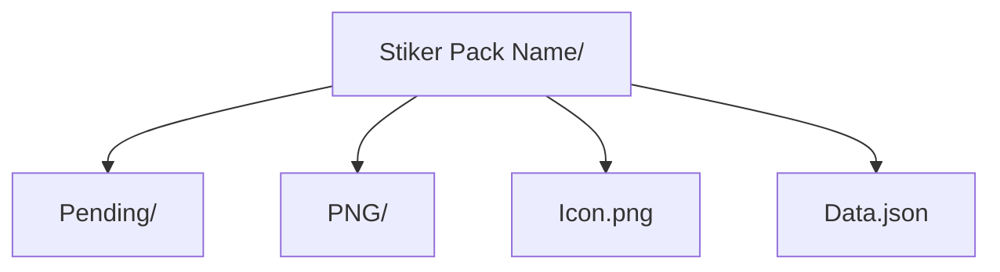

<div align="center">
  
  <div align="center"><strong>❤️ Thanks for taking the time to contribute ❤️ </strong></div>
</div>
<br>

## General

- NSFW images aren't allowed [⚠](https://docs.github.com/en/site-policy/acceptable-use-policies/github-sexually-obscene-content)

## Stickers

- The image file must be in PNG or WebP format and must fit within a 512 × 512 box (one side must be 512px and the other 512px or less)  
_Example: 
512x420, 233x512, 512x512_

- Images must have descriptive file names in the following format: One or two words that describes the sticker. You can take this as tags, but don't use more than two; You can add a number at the end. (only if it is necessary)  
_Example:_  
Happy.png  
Cat_Angry.png  
Shy.png  
Cat_Angry_2.png  
Happy_2.png  
Happy_3.png  

## Icon

- A PNG or WEBP image that fits in a 100x100 box (It has to be exactly 100x100 px)

## Structure



- **Stiker Pack Name:** This is the folder that contains a specific sticker pack. _Here you can open a pull request to add a new sticker pack to the repository_

- **Pending:** This is the folder that contains the stickers that will be added to the pack. _Here you can open a pull request to contribute to a sticker pack_

- **PNG:** This is the folder that contains the stickers that are already added to the pack

- **Icon.png:** Sticker pack icon

- **Data.json:** Sticker Pack Information. If you haven't published your sticker pack yet then "url": null  
_Data structure:_

```js
{
  "url": "https://t.me/addstickers/KuromiKawaiiPack",
  "published": true,
  "description": "A Kuromi sticker pack, cute!"
}
```

## Recommendations

 - Use good quality images
 - Respect the naming convention
 - There is a maximum number of stickers that can be in a pack (120 at this Telegram version)
 - There is animated stickers too, you can find more information here: [Telegram Stickers (Official Guide)](https://core.telegram.org/stickers)
